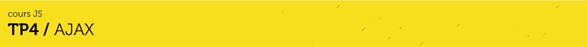
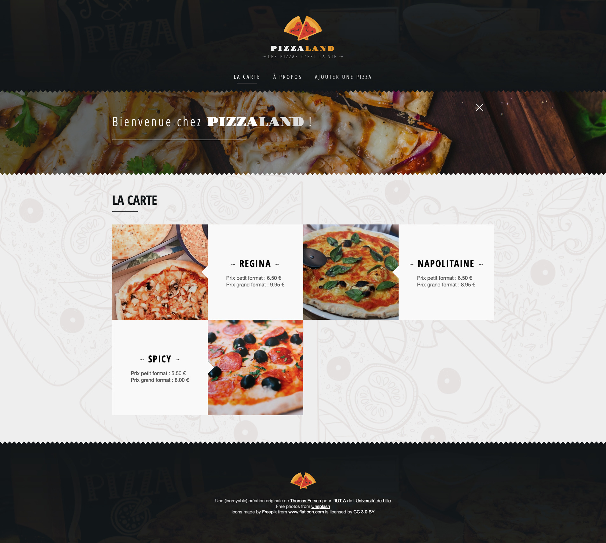

# A. Préparatifs <!-- omit in toc -->

## Sommaire <!-- omit in toc -->
- [A.1. Récupération du projet](#a1-récupération-du-projet)
- [A.3. Lancement de l'application](#a3-lancement-de-lapplication)

## A.1. Récupération du projet

**Ce repo contient une solution commentée du précédent TP.** <br>
Il va vous servir de base pour ce nouveau TP.

1. **Commencez par faire un fork du TP :**
	- soit en cliquant sur le bouton `"Créer une divergence"` (_`"Fork"` sur la version anglaise de gitlab_)
	- soit en vous rendant directement sur https://gitlab.univ-lille.fr/js/tp4/-/forks/new

	Choisissez de placer le fork dans votre profil utilisateur et configurez le repo **en mode "privé"**
	(**`Settings`** > **`Visibility, project features, permissions`** > **`Project visibility`**)


2. **Ajoutez-votre encadrant de TP en tant que "reporter" pour qu'il ait accès à votre code :**
	- dans le menu de gauche, cliquez sur `"Membres"`,
	- entrez comme **nom d'utilisateur** celui de votre encadrant de TP (`@nicolas.anquetil`, `@patricia.everaere-caillier` ou `@thomas.fritsch`)
	- ... et `"reporter"` comme **rôle**.


3. **Ouvrez ensuite un terminal et récupérez les fichiers de ce TP grâce à Git en clonant votre fork dans un dossier de votre choix :**
	```bash
	mkdir ~/tps-js
	git clone https://gitlab.univ-lille.fr/<votre-username>/tp4.git ~/tps-js/tp4
	```
	> _**NB :** Comme pour le TP1, ici je clone dans mon dossier `/home/thomas/tps-js/tp4`. **Si vous êtes sous windows faites attention au sens des slashs et au caractère `"~"`** qui représente le dossier de l'utilisateur sur système unix. Si vous êtes sous windows utilisez **Git bash** (qui comprend cette syntaxe) ou si vous tenez vraiment à utiliser **cmd** pensez à adapter !_

	> _**NB2 :** Comme pour le TP1 aussi, si vous préférez **cloner en SSH** pour ne pas avoir à taper votre mot de passe à chaque fois, renseignez votre clé SSH dans votre [compte utilisateur gitlab](https://gitlab.univ-lille.fr/profile/keys) et clonez à partir de cette URL : `git@gitlab-ssh.univ-lille.fr:js/tp4.git`_

4. **Ouvrez le projet dans VSCodium** (pour les différentes façon d'ouvrir le projet relisez les [instructions du TP1](https://gitlab.univ-lille.fr/js/tp1/-/blob/master/A-preparatifs.md#a3-ouvrir-le-projet-dans-vscodium) )
	```bash
	codium ~/tps-js/tp4
	```

5. **Installez les paquets npm nécessaires au projet** notamment le compilateur [Babel](https://babeljs.io).<br>
	Ouvrez un terminal intégré à VSCodium (<kbd>CTRL</kbd>+<kbd>J</kbd> *(PC)* / <kbd>CMD</kbd>+<kbd>J</kbd> *(Mac)*) et tapez juste :
	```bash
	npm install
	```

	> _**NB :** Vous noterez qu'on ne précise pas les paquets à installer. npm va en effet les déterminer **automatiquement** à partir du contenu du fichier `package.json` et plus particulièrement à partir des sections `"dependencies"` et `"devDependencies"` qui indiquent quels sont les paquets qui ont été installés précédemment._
	>
	> **Magique !** 🙌

## A.3. Lancement de l'application

Comme dans le précédent TP lancez un serveur HTTP et la compilation du projet **dans deux terminaux côte à côte** ([terminaux splittés](https://code.visualstudio.com/docs/editor/integrated-terminal#_terminal-splitting)) :

1. **Lancez un serveur http** dans un terminal intégré de VSCodium (<kbd>CTRL</kbd>+<kbd>J</kbd> *(PC)* / <kbd>CMD</kbd>+<kbd>J</kbd> *(Mac)*) :
	```bash
	npx serve -s -l 8000
	```
	> _**ATTENTION :** notez qu'on passe maintenant l'option `-s` à `serve` afin de permettre le **Deeplinking**. Si vous n'avez pas fait cette partie lors du précédent TP, je vous invite à prendre quelques minutes pour lire la partie [**TP3 / E.3. Le Deeplinking**](https://gitlab.univ-lille.fr/js/tp3/-/blob/master/E-navigation-avancee.md#e3-le-deeplinking) afin de comprendre l'utilité de cette option_
	>
	> _Vous remarquerez aussi qu'à la racine du projet se trouve maintenant un fichier [`serve.json`](serve.json). C'est un fichier que je vous fourni pour contourner [un bug de `serve`](https://github.com/vercel/serve/issues/565) qui vous aurait posé des problèmes pour la suite du TP. Ne me remerciez pas, ça me fait plaisir !_


2. **Lancez la compilation de votre projet** dans un **deuxième** [terminal splitté](https://code.visualstudio.com/docs/editor/integrated-terminal#_terminal-splitting) (*le `watch` et `npx serve` doivent tourner en parallèle*) :
	```bash
	npm run watch
	```

	> _**NB :** vous vous souvenez ? **`npm run` permet de lancer un script custom**_
	_que vous avez créé dans le précédent TP ([TP2 / A.5. Créer un script de build personnalisé](https://gitlab.univ-lille.fr/js/tp2/-/blob/master/A-preparatifs.md#a5-cr%C3%A9er-un-script-de-build-personnalis%C3%A9))_
	_puis modifié pour [compiler avec webpack+babel](https://gitlab.univ-lille.fr/js/tp2/-/blob/master/C-modules.md#c3-rendre-les-modules-compatibles-avec-les-vieux-navigateurs)_

3. **Vérifiez dans le navigateur que la page index.html s'affiche correctement** en ouvrant l'url http://localhost:8000.

	Le résultat attendu est le suivant :

	

	> _**NB : Si la page ne s'affiche pas correctement**, vérifiez que vous avez bien lancé le serveur http dans le dossier du projet, c'est à dire celui où se trouve le fichier `index.html`. Puis vérifiez dans la `Console` ou dans l'onglet `Sources` (Chrome) ou `Debugger` (Firefox) qu'l n'y a pas d'erreur JS lorsque la page se charge._

## Étape suivante <!-- omit in toc -->
Si la compilation fonctionne, vous pouvez passer à l'étape suivante : [B. AJAX : requêtes GET](B-ajax.md)