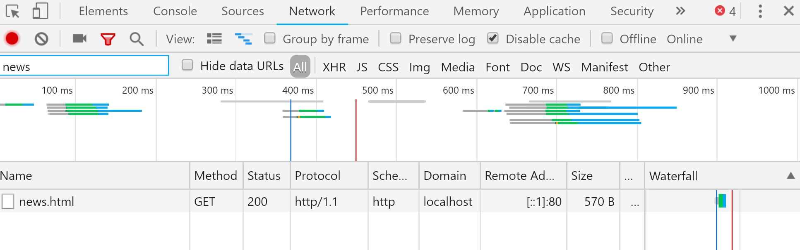
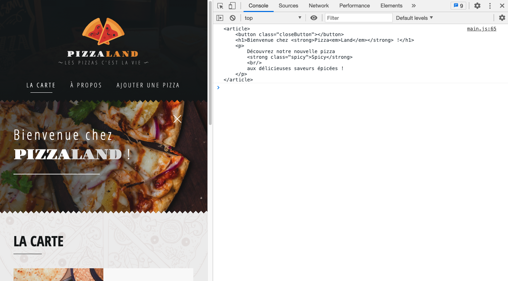
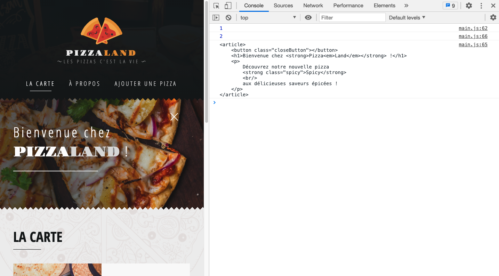
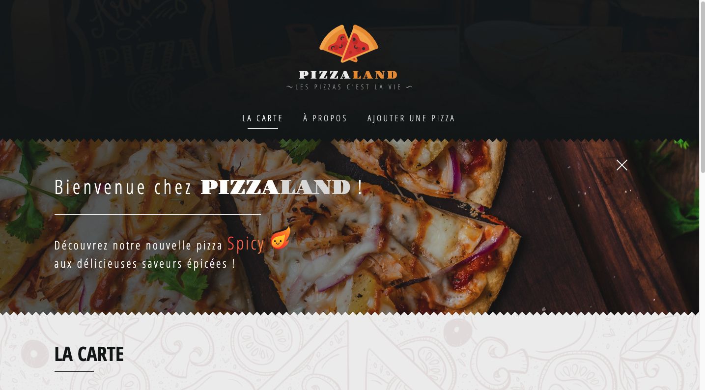
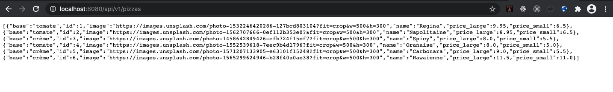
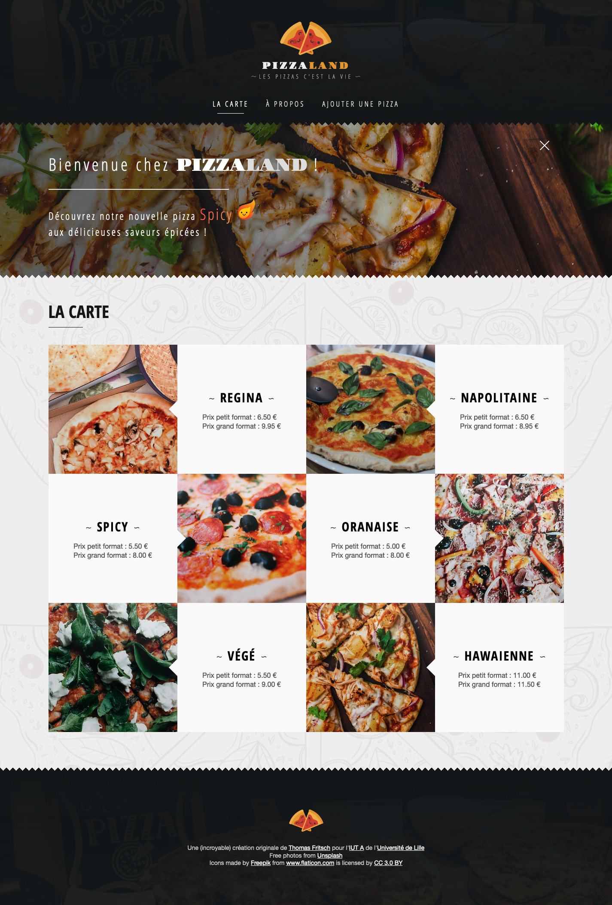

# B. AJAX <!-- omit in toc -->

_**Dans cette partie du TP nous allons travailler le chargement de données en GET : d'abord sur des fichiers statiques puis ensuite avec une base de données distante par l'intermédiaire d'une API REST/JSON.**_


## Sommaire <!-- omit in toc -->
- [B.1. XMLHttpRequest vs fetch](#b1-xmlhttprequest-vs-fetch)
- [B.2. Charger un fichier statique](#b2-charger-un-fichier-statique)
- [B.3. Appeler une API REST/JSON en GET](#b3-appeler-une-api-restjson-en-get)


## B.1. XMLHttpRequest vs fetch
Comme vu en cours (_récupérez si ce n'est pas déjà fait le pdf !_) il existe deux méthodes pour charger/envoyer des données en JS : [XMLHttpRequest](https://developer.mozilla.org/en-US/docs/Web/API/XMLHttpRequest) et l'[API fetch](https://developer.mozilla.org/en-US/docs/Web/API/Fetch_API/Using_Fetch)

**C'est l'API fetch que nous utiliserons dans ce TP.** \
En effet, elle dispose d'une syntaxe plus concise, avec laquelle il est plus facile de chaîner les traitements grâce aux [Promises](https://developer.mozilla.org/fr/docs/Web/JavaScript/Guide/Utiliser_les_promesses).

Pour rappel, le support navigateur de l'API fetch est plutôt bon :

<a href="http://caniuse.com/#feat=fetch">
	<picture>
		<source type="image/webp" srcset="https://caniuse.bitsofco.de/image/fetch.webp">
		
	</picture>
</a>

> _**NB :** Comme on peut le voir, **aucune version d'Internet Explorer n'est compatible avec l'API fetch**. C'est aussi le cas des versions d'android 4.4.4 et inférieures. Heureusement, un [polyfill](https://fr.wikipedia.org/wiki/Polyfill) développé par Github est disponible ici : https://github.com/github/fetch. Sur un projet réel, s'il fallait supporter ces navigateurs anciens, vous devriez mettre en place ce polyfill mais pour gagner du temps nous ignorerons cette problématique dans le TP._


## B.2. Charger un fichier statique
**Avant de connecter notre application au serveur REST/JSON, nous allons nous entraîner sur un fichier statique.**

1. **Créez un fichier `news.html` à la racine (au même niveau que le `index.html`) avec le code html suivant** :
	```html
	<article>
		<button class="closeButton"></button>
		<h1>Bienvenue chez <strong>Pizza<em>Land</em></strong> !</h1>
		<p>
			Découvrez notre nouvelle pizza
			<strong class="spicy">Spicy</strong>
			<br/>
			aux délicieuses saveurs épicées !
		</p>
	</article>
	```
2. **Dans le fichier main.js, à la fin du code, lancez le chargement du fichier `news.html` avec l'API fetch** :
	```js
	fetch('./news.html');
	```

	Rechargez la page html dans le navigateur et vérifiez dans l'onglet Network/Réseau des devtools que votre page lance bien le chargement du fichier `news.html`.

	

	Notez qu'il s'agit bien d'une requête HTTP et pas d'un appel à un fichier local : l'URL de la requête est bien http://localhost:8000/news.html c'est donc bien le serveur HTTP (lancé par npx) qui génère la réponse HTTP retournée au navigateur.

	Maintenant que l'on arrive à lancer la requête, reste à exploiter la réponse renvoyée par le serveur et les données qu'elle contient !

3. **Commencez par inspecter la réponse retournée par `fetch()` grâce à la méthode `.then()`** :
	```js
	fetch('./news.html')
		.then( response => console.log(response) );
	```

	Rechargez la page et regardez ce qui s'affiche dans la console : il s'agit d'un objet de type [Response](https://developer.mozilla.org/en-US/docs/Web/API/Response) retourné par l'API fetch.

	

	Comme vu en cours, cet objet contient notamment des propriétés `ok`, `status` et `statusText` qui permettent d'en savoir plus sur la réponse HTTP retournée par le serveur.

4. **On va maintenant pouvoir récupérer les données brutes contenues dans la réponse HTTP grâce à la méthode [response.text()](https://developer.mozilla.org/en-US/docs/Web/API/Body/text)** :
	```js
	fetch('./news.html')
	  .then( response => response.text() )
	  .then( responseText => console.log(responseText) );
	```
	Vérifiez que la console affiche bien le contenu HTML du fichier `news.html`

	

	*Maintenant que l'on est capable de récupérer le contenu du fichier `news.html` sous forme de chaîne de caractères, il ne reste plus qu'à **l'injecter dans la page HTML** !*

5. **Pour bien comprendre l'ordre d'exécution d'un code asynchrone comme cet appel AJAX, ajoutons des instructions `console.log()` dans le code précédent** :
	```js
	console.log(1);
	fetch('./news.html')
	  .then( response => response.text() )
	  .then( responseText => console.log(responseText) );
	console.log(2);
	```
    Regardez dans quel ordre s'affichent les log dans la console

	

	Est-ce que cela vous semble normal ? Non ? C'est pourtant logique : la fonction qui est passée au deuxième `.then()` n'est exécutée qu'une fois que la requête http est terminée (càd. une fois que le fichier est fini de télécharger). Le reste du code continue de s'exécuter en attendant que la requête se termine !

	Si vous avez compris, vous pouvez effacer les `console.log` inutiles et passer à la suite. Sinon appelez le professeur !

6. **Avant d'injecter le code html dans la page, vous allez devoir faire un peu de ménage :**
	- dans le fichier `index.html`, supprimez le **contenu** de la balise `<section class="newsContainer">...</section>` (la balise doit toujours exister dans la page mais elle doit être vide).
	- Puisque l'on a supprimé le bouton `closeButton`, le code JS qui détectait le clic dessus ne peut plus fonctionner. Commentez-le, on en aura besoin plus tard.
	- Commentez aussi le code qui affichait le bandeau `newsContainer.style.display = '';`. On ne veut plus afficher le bandeau dès le chargement de la page, mais uniquement lorsqu'on aura reçu le contenu du fichier `news.html`

1. **À l'aide de l'API DOM injectez le contenu du fichier `news.html` dans la section `<section class="newsContainer"></section>`.** Plutôt que de tout coder dans le `.then()` on va passer par une nouvelle fonction `displayNews`:
	```js
	function displayNews(html) {
		// 1. injectez le contenu du fichier dans la section .newsContainer
		// 2. affichez la balise .newsContainer
	}
    fetch('./news.html')
	    .then( response => response.text() )
	    .then( displayNews );
	```
	Une fois que vous aurez codé la fonction `displayNews` la page devrait ressembler à ceci :

	

8. Faites en sorte que le clic sur le `closeButton` fonctionne à nouveau

## B.3. Appeler une API REST/JSON en GET
**Maintenant que l'on est capables de récupérer une ressource externe en JS et d'en afficher le contenu, connectons notre application au serveur REST développé en cours de programmation répartie !!!**

1. **Téléchargez le serveur REST/JSON** sur https://filesender.renater.fr/?s=download&token=002059e4-f26f-4cf8-ad48-a8da6384d3d4
2. **Lancez le serveur dans un terminal** :
	```bash
	java -jar pizzaland-jar-with-dependencies.jar
	```
3. **Vérifiez que le serveur fonctionne correctement en ouvrant dans votre navigateur la page http://localhost:8080/api/v1/pizzas**

	

1. **Supprimez toute trace de nos données en "dur" :**
	- supprimez le fichier `data.js` et son import dans le `main.js`
	- supprimez la ligne `pizzaList.pizzas = data;` du `main.js`

2. Dans le fichier `src/pages/PizzaList.js`, overridez la méthode `mount()` comme nous l'avions fait lors du précédent TP pour la classe `PizzaForm`, et **lancez un appel AJAX vers l'URL http://localhost:8080/api/v1/pizzas**.

	> _**NB :** cette méthode `mount()`, [codée lors du précédent TP](https://gitlab.univ-lille.fr/js/tp3/-/blob/master/D-formulaires.md#d2-pr%C3%A9paratifs-la-classe-page) est appelée par le `Router` lorsque l'utilisateur se rend sur la page (juste après qu'elle soit affichée). En plaçant l'appel AJAX dans la méthode `mount()`, il sera donc déclenché à chaque fois que l'utilisateur arrive sur la page "La carte" ce qui permettra d'avoir toujours des données à jour._

3. **Une fois les données reçues, mettez à jour la page avec la liste des pizzas avec les données reçues**

	> _**Indices :** cette opération doit se faire en 2 étapes. Il faut :_
	> 1. _**mettre à jour les children** de la `PizzaList` (en appelant par exemple le setter `set pizzas()`...)_
	> 2. _**mettre à jour le DOM** en vous servant de la propriété `this.element` héritée de la classe `src/pages/Page.js` et de la méthode `render()` héritée de  la classe `Component`_

	

	Ca y est ! La page s'affiche maintenant avec la liste complète des pizzas contenues dans la base de données du serveur REST !! :metal: :tada: :trophy: :pizza: :beers:

## Étape suivante  <!-- omit in toc -->
Maintenant que l'on est capable de faire communiquer notre appli JS avec un serveur distant, nous allons voir dans le prochain exercice comment envoyer des données au serveur pour qu'il les enregistre en bdd : [C. AJAX : POST & formulaires](C-post.md).