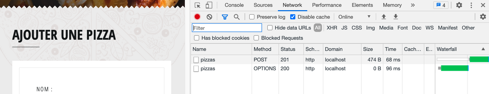
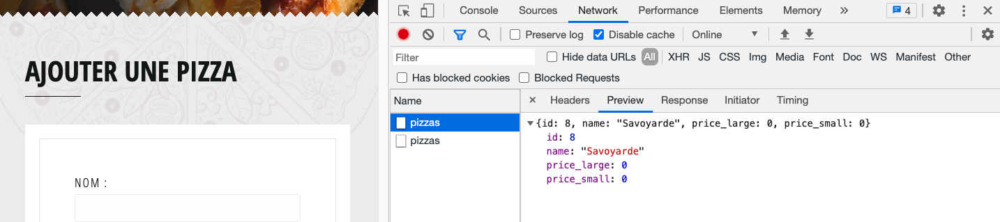
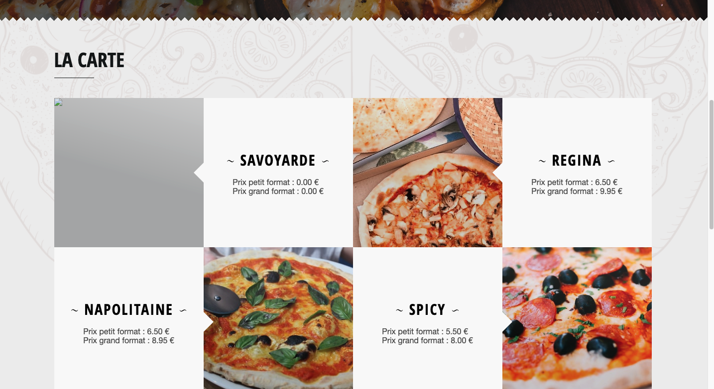
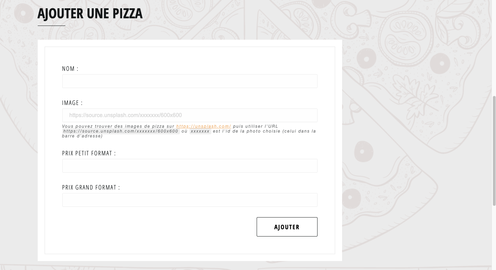
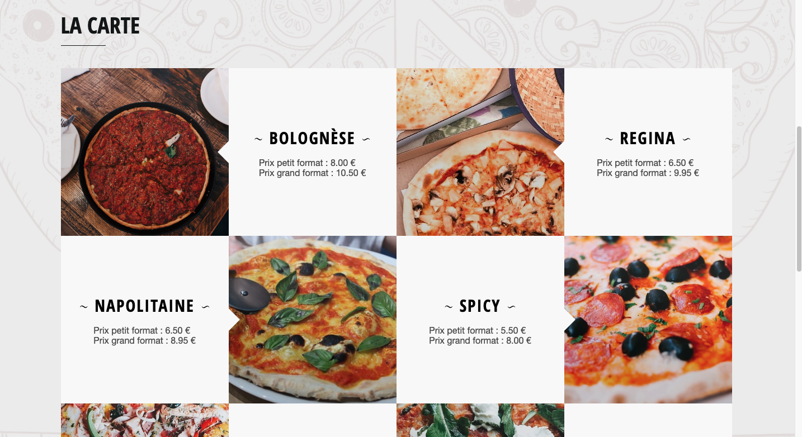

# C. POST une pizza <!-- omit in toc -->

**Maintenant que l'on arrive à charger des données depuis l'API REST tentons d'envoyer des données au serveur pour mettre à jour la BDD depuis le JS !**

## Sommaire <!-- omit in toc -->
- [C.1. POST simple](#c1-post-simple)
- [C.2. Redirection](#c2-redirection)
- [C.3. Formulaire complet](#c3-formulaire-complet)

## C.1. POST simple
**Pour envoyer des données au serveur, on va se servir du formulaire d'ajout de pizza, `PizzaForm` (_codé dans le précédent TP_).** Si vous n'aviez pas fait cette partie du TP, je vous invite à prendre quelques minutes pour lire [l'énoncé de cet exercice](https://gitlab.univ-lille.fr/js/tp3/-/blob/master/D-formulaires.md#d3-le-formulaire-dajout-de-pizza) et pour consulter ma "solution" dans le fichier [`src/pages/PizzaForm.js`](src/pages/PizzaForm.js).

Dans la méthode `submit` (_méthode déclenchée à la soumission du formulaire_) de la classe `AddPizzaPage`, appelez le webservice `POST` sur `http://localhost:8080/api/v1/pizzas` afin d'ajouter une nouvelle pizza **avec les informations saisies par l'utilisateur** (_uniquement si aucune erreur de saisie n'est détectée bien sûr !_).

La technique à utiliser pour envoyer les données au serveur dépendent de la façon dont est codé le webservice. Ici, le webservice s'attend à recevoir une requête dont le `"Content-Type"` est `"application/json"`. Il faut donc envoyer à fetch une chaîne de caractères encodée en en JSON grâce à [`JSON.stringify`](https://developer.mozilla.org/en-US/docs/Web/JavaScript/Reference/Global_Objects/JSON/stringify) :

```js
fetch(
	'http://localhost:8080/api/v1/pizzas',
	{
		method:'POST',
		headers: { 'Content-Type': 'application/json' },
		body: JSON.stringify(pizza)
	}
);
```

Le webservice `POST` `/api/v1/pizzas` s'attend à recevoir en paramètre une chaîne JSON de la forme suivante (_`"Bolognèse"` doit évidemment être remplacé par la valeur saisie par l'utilisateur dans le champ "Nom" du formulaire !_) :
```json
{
	"name": "Bolognèse"
}
```

Si l'envoi s'est bien passé, le webservice retourne en entête un status `201 Created` et dans le corps de la réponse le JSON correspondant à la pizza créée :





Pour confirmer que tout a fonctionné, rendez-vous sur la page "La carte" et constatez que la pizza que vous avez saisie dans le formulaire s'est ajoutée en haut de la liste :



C'est une première victoire : on est maintenant capables d'envoyer des données au webservice et d'ajouter une nouvelle pizza mais on se rend vite compte **qu'il manque encore plusieurs infos pour que la pizza soit complète** (_les prix et l'image notamment_).

## C.2. Redirection

Avant de compléter le formulaire avec les champs nécessaires, faites déjà en sorte que **lorsque l'utilisateur a fini d'ajouter une pizza, il soit redirigé automatiquement vers la page "La carte"** de manière à voir tout de suite la pizza qu'il vient d'ajouter sans avoir besoin de cliquer sur le lien du menu (_et **sans rechargement de page** bien sûr, on est dans une SPA hein !_).

> _**Astuce :** si vous voulez "nettoyer" la bdd, pour effacer vos tests par exemple, il suffit de stopper et de relancer le serveur REST !_

## C.3. Formulaire complet
_**Maintenant que la mécanique de navigation formulaire -> liste est opérationnelle, finalisons le formulaire d'ajout de pizza !**_

Ajoutez des champs pour l'url de l'image, et les prix dans le code HTML retourné par `PizzaForm` :
```html
<label>
	Image :<br/>
	<input type="text" name="image" placeholder="https://source.unsplash.com/xxxxxxx/600x600">
	<small>Vous pouvez trouver des images de pizza sur <a href="https://unsplash.com/">https://unsplash.com/</a> puis utiliser l'URL <code>https://source.unsplash.com/xxxxxxx/600x600</code> où <code>xxxxxxx</code> est l'id de la photo choisie (celui dans la barre d'adresse)</small>
</label>
<label>
	Prix petit format :
	<input type="number" name="price_small" step="0.05">
</label>
<label>
	Prix grand format :
	<input type="number" name="price_large" step="0.05">
</label>
```




Adaptez enfin le JSON envoyé au serveur en ajoutant les propriétés `image`, `price_small` et `price_large` :
```json
{
	"name":"Bolognèse",
	"image": "https://source.unsplash.com/uUgnfIwpu3M/600x600",
	"price_small": 8,
	"price_large": 10.5,
}
```

> _**NB :** notez que les prix sont exprimés en nombres et pas en chaînes de caractères ! Pour caster une chaine en nombre, vous avez plusieurs solutions : [`parseFloat()`](https://developer.mozilla.org/fr/docs/Web/JavaScript/Reference/Objets_globaux/parseFloat) ou [Number()](https://developer.mozilla.org/fr/docs/Web/JavaScript/Reference/Objets_globaux/Number). Je vous laisse entre les mains de stackoverflow pour décider de la technique la plus adaptée à notre situation : https://stackoverflow.com/a/13676265 (lisez aussi les commentaires à cette réponse...) !_

Une fois l'enregistrement terminé, vous devriez cette fois voir une vignette complète, avec l'image et les prix s'ajouter dans la liste :



_**Félicitations, c'est tout pour aujourd'hui !**_